# NETWORKWALKS-TSHOLELE-B083-WK2-PM1-PM5-CYBERSECURITY-FOOTPRINTING-SCANNING
Week 2 - Footprinting, Reconnaissance &amp; Network Scanning - Networkwalks Cybersecurity Internship Batch B083
# NETWORKWALKS Cybersecurity Internship - Batch B083

## Week 2 - Footprinting, Reconnaissance & Network Scanning

**Intern:** Tsholele Phoofolo
**Batch:** B083
**Week:** 2
**Project:** PM1, PM4, PM5 - Footprinting & Network Scanning
**Date:** September 2026

---

## Project Overview

Week 2 focused on the **reconnaissance phase** of cybersecurity — the passive intelligence-gathering stage that precedes any real security test. This is the phase where an attacker (or defender) builds a complete profile of a target using only publicly available information.

Three modules were completed:

- **PM1** — Footprinting with 6 Kali Linux tools (whois, whatweb, nslookup, curl, wafw00f, dnsrecon) against `networkwalks.com`
- **PM4** — Footprinting with theHarvester against `microsoft.com`
- **PM5** — Network scanning with Zenmap (Nmap GUI) on the local subnet

---

## Tools Used

| Tool | Purpose | Platform |
|------|---------|----------|
| whois | Domain registration details | Kali Linux |
| whatweb | Web technology fingerprinting | Kali Linux |
| nslookup | DNS resolution | Kali Linux |
| curl -I | HTTP response header inspection | Kali Linux |
| wafw00f | WAF detection | Kali Linux |
| dnsrecon | Full DNS enumeration | Kali Linux |
| theHarvester | Email / host OSINT | Kali Linux |
| Zenmap (Nmap GUI) | Local network host discovery | Windows |
| ipconfig / arp | Local IP and MAC info | Windows CMD |

---

## PM1 - Footprinting with Multiple Kali Tools

### WHOIS
Domain registered via GoDaddy; name servers point to HostGator; DNSSEC unsigned.

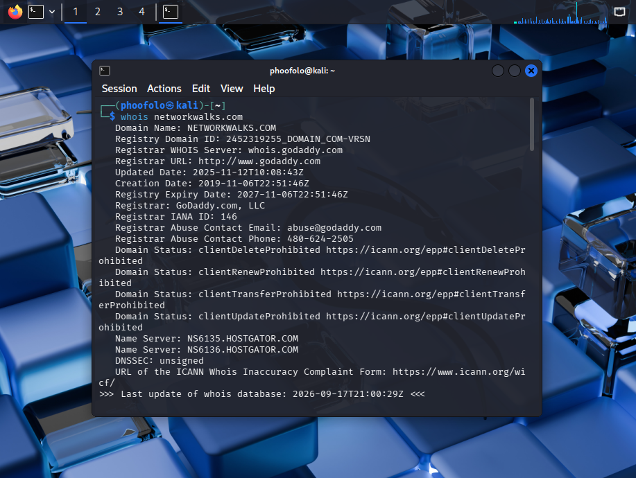

### WhatWeb
WordPress 7.1.1, WP Download Manager 3.3.58, Apache, Bootstrap 7.1.1, jQuery 3.7.1; server IP 192.232.216.135; email info@networkwalks.com exposed.

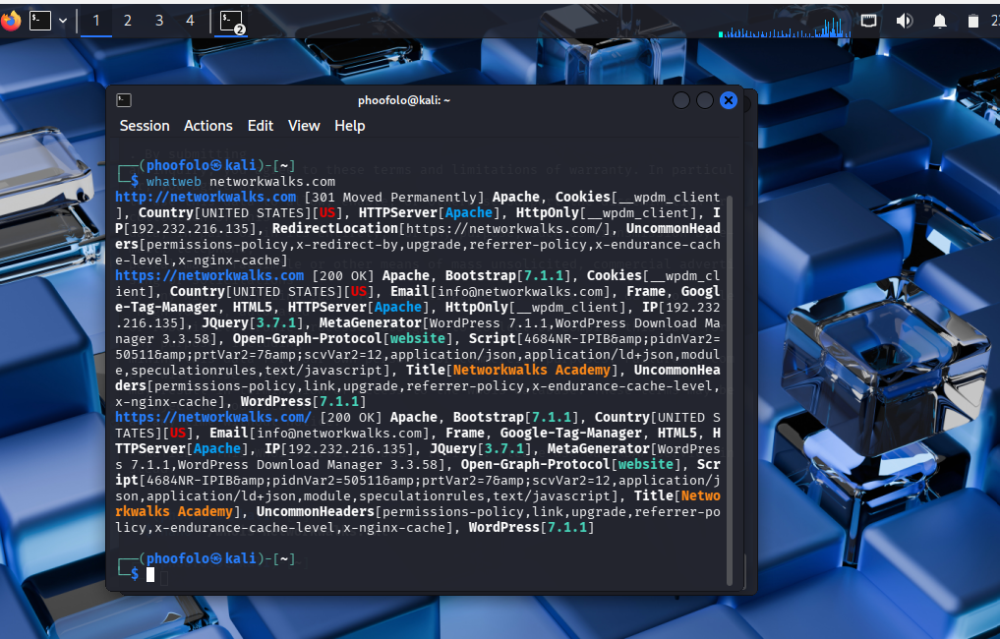

### nslookup
networkwalks.com resolves to 192.232.216.135.

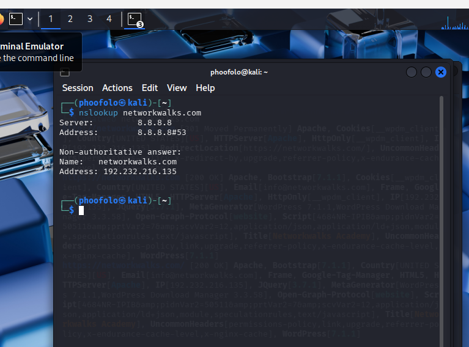

### curl -I
HTTP/2 200; Apache server; WordPress REST API endpoint /wp-json/ exposed.

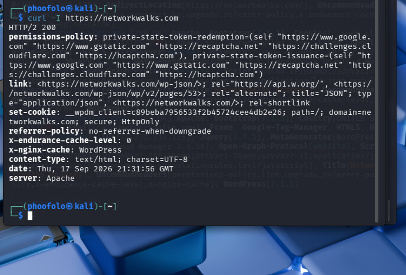
### wafw00f
Site protected by ModSecurity (SpiderLabs) WAF.

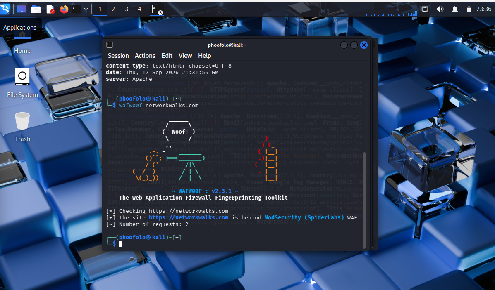

### dnsrecon
SPF record revealed (HostGator infrastructure); SRV record for cPanel email autodiscovery; 8 DNS records total.

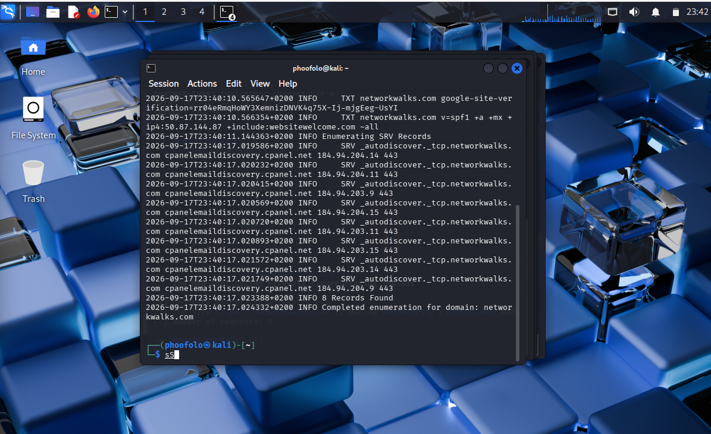

---

## PM4 - theHarvester

### Baidu source, limit 1000

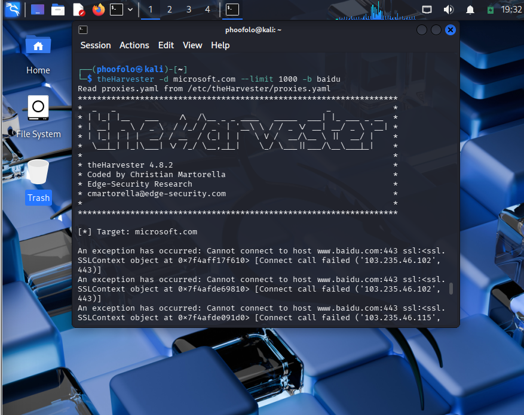
### All sources, limit 50
Only 1 host found: `learn.microsoft.com`. Many sources require API keys; Yahoo returned 522 error. Demonstrates the limitations of passive OSINT.

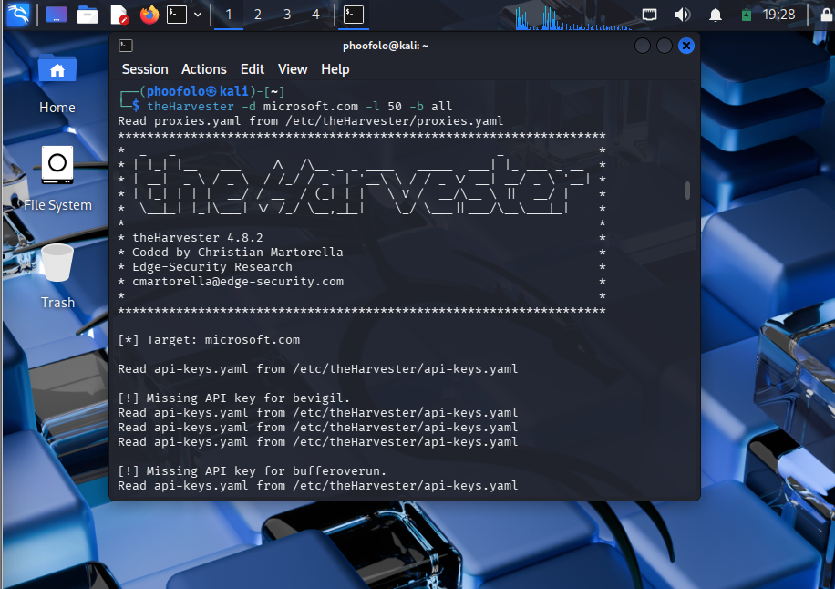
---

## PM5 - Network Scanning with Zenmap

### Local IP & subnet
Identified 192.168.56.1/24 and 192.168.172.1/24 from ipconfig.

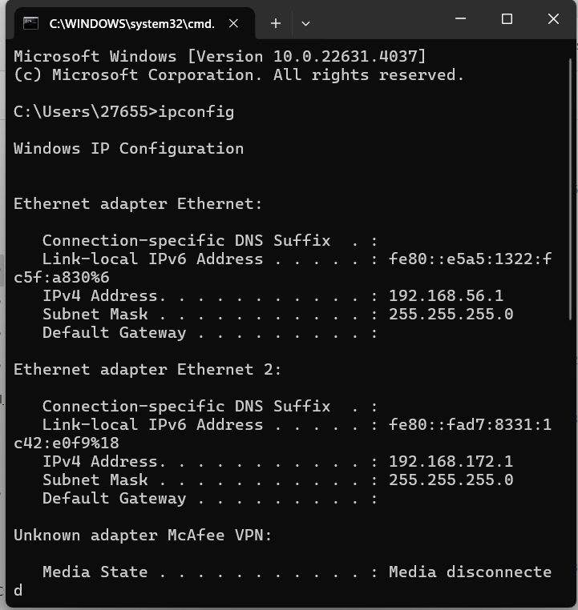

### Ping scan of 192.168.56.0/24
256 IPs scanned; 1 live host found (the Windows host itself). Kali VM was powered off at scan time.

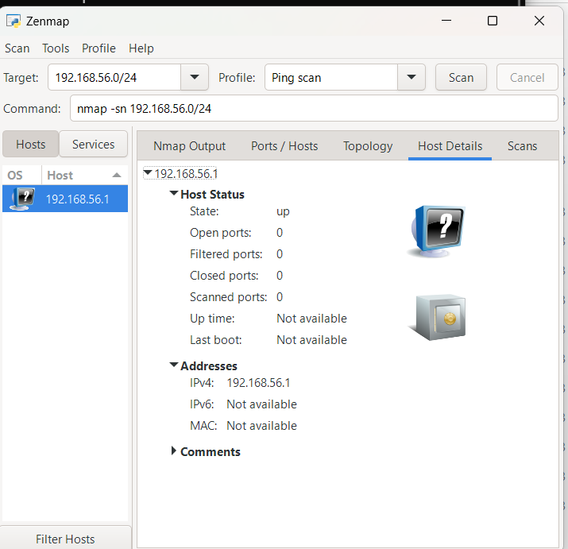

### Nmap Output
Raw output of the ping scan.

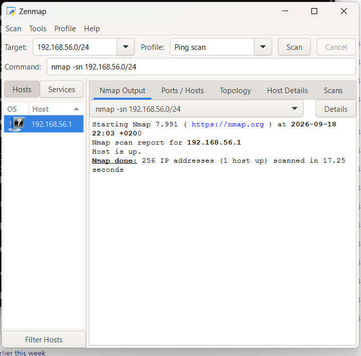
### Topology
Network topology generated and saved as PDF on the Desktop.

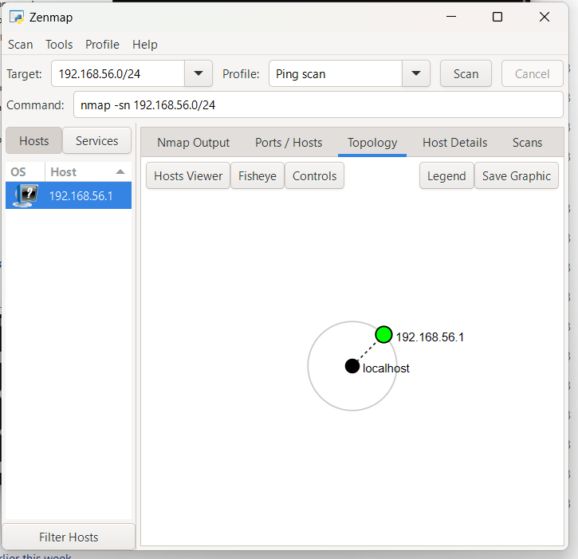
---

## Risk Analysis

| # | Finding | Impact | Risk |
|---|---------|--------|------|
| 1 | WordPress 7.1.1 + WPDM 3.3.58 version exposed | Searchable in CVE databases | Medium |
| 2 | Server IP identified (192.232.216.135) | Direct targeting possible | Low |
| 3 | /wp-json/ REST API exposed | User/plugin enumeration | Low |
| 4 | WAF detected (ModSecurity) | Attacker knows to evade | Low |
| 5 | Email info@networkwalks.com exposed | Phishing target | Medium |
| 6 | DNSSEC unsigned | DNS spoofing possible | Medium |

---

## Recommendations

1. Hide version banners in server responses
2. Keep WordPress, plugins, and themes updated
3. Enable DNSSEC
4. Tighten SPF policy (use -all instead of ~all)
5. Audit publicly exposed email addresses
6. Restrict /wp-json/ REST API if not needed externally
7. Monitor ModSecurity WAF logs
8. Perform periodic internal network scans
9. Maintain network documentation
10. Always require written authorization before testing

---

## Conclusion

Week 2 covered the reconnaissance and scanning phases of cybersecurity. Using six Kali tools, theHarvester, and Zenmap, I built a complete picture of the target without touching any system directly. The exercises showed that recon is passive, powerful, and hard to detect — and that defenders must run the same tools on their own infrastructure to know what they're leaking.

Key lesson: **you cannot attack what you have not first understood.**

---

## Security & Ethical Use

All activities were performed strictly within the authorized scope of the Networkwalks Cybersecurity Internship (Batch B083). No exploitation or unauthorized access was attempted.

---

## Tags

`#Networkwalks` `#Cybersecurity` `#KaliLinux` `#OSINT` `#Nmap` `#Reconnaissance` `#EthicalHacking` `#BatchB083`
